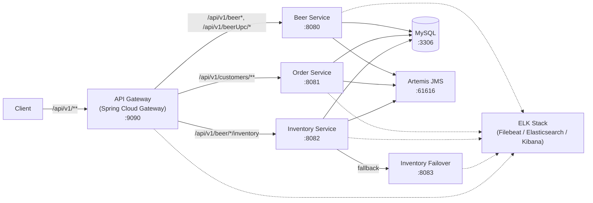
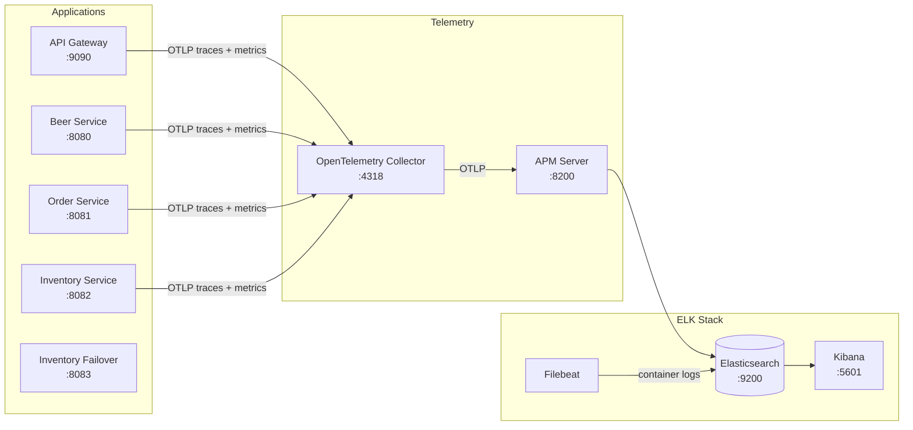

# SFG Beer Works - Brewery Microservices

This project has a services of microservices for deployment via Docker Compose and Kubernetes.

You can access the API documentation [here](https://sfg-beer-works.github.io/brewery-api/#tag/Beer-Service)
Official Website: https://kubebyexample.com

## Overview

Reactive API gateway (Spring Cloud Gateway / WebFlux, port 9090) that routes requests to the sibling
brewery microservices. Locally, the whole stack is defined in `compose.yaml`.

Sibling microservices (each is a microservice with its own repository; the images are pulled from
Docker Hub with the prefix `domboeckli/`):

- beer-service
- order-service
- inventory-service
- inventory-failover

You can build those projects yourself with `mvn install`; this pushes an image to your local Docker
image repo as `local/...`.

Components provided by `compose.yaml`:

- API Gateway (this project)
- Database (MySQL)
- Message Broker (Artemis / JMS)
- Consolidated Logging (Elasticsearch, Kibana, Filebeat)

### Architecture



### Monitoring / ELK Stack



Kibana Web Gui:

- compose: http://localhost:5601
- Kubernetes (NodePort): http://localhost:30561/app/home#/

## Commands

- Start everything

```bash
docker compose -f compose.yaml up -d
```

- Stop all

```bash
docker compose -f compose.yaml stop
```

- Stop and Remove all

```bash
docker compose -f compose.yaml down
```

- Check what is running

```bash
docker ps
```

- Rebuild filebeat

Remark: uses the directory `filebeat/` which contains a Dockerfile and the configuration yml. Note
that `compose.yaml` currently uses the stock filebeat image, so this requires a `build` section.

```bash
docker compose -f compose.yaml build filebeat
```

> Note: `compose.yaml` is also started automatically when the app boots
> (`spring.docker.compose.enabled=true`).

After installation you can access the kibana web gui and check the log. first you need a little configuration described below

Open elastic search/kibana:
with browser open url: http://localhost:5601/app/home#/

Initially go to discover -> create index pattern: filebeat* -> next -> add @timestamp -> create index pattern
Go back to discover: there you will see log statement from different services

## Sandbox (local dev environment)

The sandbox consists of the app (Spring Boot Gateway, port 9090) plus MySQL, Artemis (JMS), the ELK
stack and the sibling beer/inventory/order services, provided by `compose.yaml`. The services start
automatically via `spring.docker.compose.enabled=true` when the app boots, so usually one step is
enough.

### Start the sandbox (opencode-sandbox-kit)

The sandbox is provisioned by the opencode-sandbox-kit and runs as a Docker container. It mounts this
repo, starts opencode, and connects the IntelliJ MCP server.

Allow the kit source (GitHub without cloning):

```powershell
sbx settings set kit.allowedSources --% "[\"docker.io/\",\"github.com/dboeckli/\"]"
```

Start a new sandbox:

```powershell
sbx run opencode --name kbe-brewery-gateway --kit "git+https://github.com/dboeckli/opencode-sandbox-kit.git#dir=opencode-agent" "C:\development\projects\kbe-brewery-gateway"
```

Start the sandbox with Kubernetes support:

```powershell
sbx run opencode --name kbe-brewery-gateway --kit "git+https://github.com/dboeckli/opencode-sandbox-kit.git#dir=opencode-agent" "C:\development\projects\kbe-brewery-gateway" "$env:USERPROFILE\.kube:ro"
```

Apply the kit to an existing sandbox (restarts the sandbox, VM state is kept):

```powershell
sbx kit add kbe-brewery-gateway "git+https://github.com/dboeckli/opencode-sandbox-kit.git#dir=opencode-agent"
```

## Kubernetes

Deployment is Helm-only; see [Deployment with Helm](#deployment-with-helm) below.

### Deployment with Helm

Be aware that we are using a different namespace here (not default).

To run maven filtering for destination target/helm

```bash
mvn clean install -DskipTests 
```

Go to the directory where the tgz file has been created after 'mvn install'

```powershell
cd target/helm/repo
```

unpack

```powershell
$file = Get-ChildItem -Filter kbe-brewery-gateway-chart-*.tgz | Select-Object -First 1
tar -xvf $file.Name
```

install

```powershell
$APPLICATION_NAME = Get-ChildItem -Directory | Where-Object { $_.LastWriteTime -ge $file.LastWriteTime } | Select-Object -ExpandProperty Name
helm upgrade --install $APPLICATION_NAME ./$APPLICATION_NAME --namespace kbe-brewery-gateway --create-namespace --wait --timeout 8m --debug --render-subchart-notes
```

show logs

```powershell
kubectl get pods -l app.kubernetes.io/name=$APPLICATION_NAME -n kbe-brewery-gateway
```

replace $POD with pods from the command above

```powershell
kubectl logs $POD -n kbe-brewery-gateway --all-containers
```

test

```powershell
helm test $APPLICATION_NAME --namespace kbe-brewery-gateway --logs
```

uninstall

```powershell
helm uninstall $APPLICATION_NAME --namespace kbe-brewery-gateway
```

delete all

```powershell
kubectl delete all --all -n kbe-brewery-gateway
```

delete all

```powershell
kubectl delete all --all -n kbe-brewery-order-micro-service
```

create busybox sidecar

```powershell
kubectl run busybox-test --rm -it --image=busybox:1.36 --namespace=kbe-brewery-order-micro-service --command -- sh
```

You can use the actuator rest call to verify via port 30090

## Consolidated Logging

### elasticsearch

will hold the log data
curl: http://localhost:30920

### kibana

will enable search in the log database on elastic search.
Web Gui: http://localhost:30561/app/home#/

### filebeat

retrieves the logs from all services.
Some Manual Setup is needed:

Go to the kibana Gui and:
discover -> create index pattern: filebeat* -> next -> add @timestamp -> create index pattern


Go back to discover:

